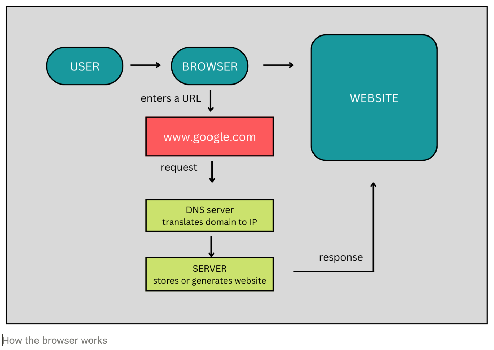

# How a browser works?
#### _What happens when a URL is entered:_

In the simplest terms, the browser is a rendering engine. Its job is to download a web page and render it in a way that’s understandable by a human being.

- **DNS resolution**- This process makes sure that once the user enters a URL, the browser knows which server it has to connect to. The browser checks the cache for a DNS record to find the corresponding IP address of maps.google.com.The browser contacts a DNS server to find that google.comtranslates to 216.58.207.110, an IP address the browser can connect to.
- **HTTP exchange**- Once the browser has identified which server is going to serve our request, it will initiate a TCP connection with it and begin the HTTP exchange. This is nothing but a way for the browser to communicate with the server what it needs, and for the server to reply back. For example, after the browser has successfully connected to the server behind `google.com,` it will send a request that looks like the following:
    `GET / HTTP/1.1Host: google.comAccept: */*`
- **Rendering**- In the  body  of the response, the server includes the representation of the response according to the `Content-Type` header. In our case, the content type was set to `text/html`, so we are expecting HTML markup in the response — which is exactly what we find in the body.
    This is where a browser truly shines. It parses the HTML, loads additional resources included in the markup (for example, there could be JavaScript files or CSS documents to fetch) and presents them to the user as soon as possible.
    Once more, the end result is something the average person can understand.

- Same process repeats

#### _How the browser fetches the desired result?_
The browser has **7 high-level architechtural components** that enable it to render the results as seen by the user
- **The user interface:**
This includes the address bar, back/forward button, bookmarking menu, etc. Every part of the browser display except the window where you see the requested page.
- **The browser engine:** 
This enables actions between the UI and the rendering engine.
- **The rendering engine:**
This is responsible for displaying requested content. For example if the requested content is HTML, the rendering engine parses HTML and CSS, and displays the parsed content on the screen.
- **Networking:** 
This is for network calls such as HTTP requests, using different implementations for different platform behind a platform-independent interface.
- **UI backend:** 
This is used for drawing basic widgets like combo boxes and windows. This backend exposes a generic interface that is not platform specific. Underneath it uses operating system user interface methods. Also responsible for implementing the z layer, overlapping componenets in the rendering process.
- **JavaScript interpreter:**
Used to parse and execute JavaScript code. Add the interactivity to the page. 
- **Data storage:** 
This is a persistence layer. The browser may need to save all sorts of data locally, such as cookies. Browsers also support storage mechanisms such as localStorage, IndexedDB, WebSQL and FileSystem.
Markdown is a lightweight markup language based on the formatting conventions
that people naturally use in email.

#### _How does the rendering process work?_
The below diagram explains the overall rendering engine flow:

Steps involved are:
- **Parsing** a document means translating it to a structure the code can use. The result of parsing is usually a tree of nodes that represent the structure of the document. This is called a parse tree or a syntax tree.

    Parsing can be separated into two sub processes: lexical analysis and syntax analysis.
    Lexical analysis is the process of breaking the input into tokens. Tokens are the language vocabulary: the collection of valid building blocks. In human language it will consist of all the words that appear in the dictionary for that language.
    Syntax analysis is the applying of the language syntax rules.
    
    Parsers usually divide the work between two components: the **lexer** (sometimes called tokenizer) that is responsible for breaking the input into valid tokens, and the **parser** that is responsible for constructing the parse tree by analyzing the document structure according to the language syntax rules.
    
- **Script processing** The model of the web is synchronous. Authors expect scripts to be parsed and executed immediately when the parser reaches a `<script>`
 tag. The parsing of the document halts until the script has been executed. If the script is external then the resource must first be fetched from the network - this is also done synchronously, and parsing halts until the resource is fetched. This was the model for many years and is also specified in HTML4 and 5 specifications. Authors can add the "defer" attribute to a script, in which case it will not halt document parsing and will execute after the document is parsed. HTML5 adds an option to mark the script as asynchronous so it will be parsed and executed by a different thread.
- **Layout** - When the renderer is created and added to the tree, it does not have a position and size. Calculating these values is called layout or reflow.
    HTML uses a flow based layout model, meaning that most of the time it is possible to compute the geometry in a single pass. Elements later "in the flow" typically do not affect the geometry of elements that are earlier "in the flow", so layout can proceed left-to-right, top-to-bottom through the document. There are exceptions: for example, HTML tables may require more than one pass.
    
    The coordinate system is relative to the root frame. Top and left coordinates are used.
    Layout is a recursive process. It begins at the root renderer, which corresponds to the `<html>` element of the HTML document. Layout continues recursively through some or all of the frame hierarchy, computing geometric information for each renderer that requires it.
    
    The position of the root renderer is 0,0 and its dimensions are the viewport - the visible part of the browser window.
    All renderers have a "layout" or "reflow" method, each renderer invokes the layout method of its children that need layout.
- **Painting** - In the painting stage, the render tree is traversed and the renderer's "paint()" method is called to display content on the screen. Painting uses the UI infrastructure component.
    
    [CSS2 defines the order of the painting process](http://www.w3.org/TR/CSS21/zindex.html). This is actually the order in which the elements are stacked in the [stacking contexts](https://web.dev/howbrowserswork/#stackingcontext). This order affects painting since the stacks are painted from back to front. The stacking order of a block renderer is:
1. background color
2. background image
3. border
4. children
5. outline

