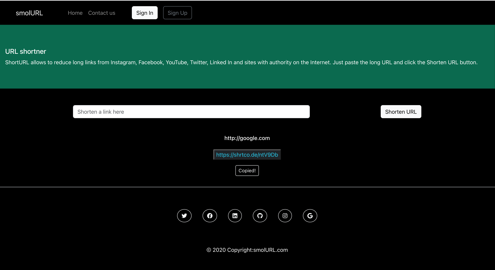

# React URL shortener

[Click her to checkout the app](https://smolurlshortener.netlify.app/)

This project was built with [Create React App](https://github.com/facebook/create-react-app), with shrtco.de as API.

You can find more about the assignment at [API shortner app](https://pestotech.teachable.com/courses/1911069/lectures/43351654) 

### Features
* User can type in a link and get a shortened URL
* User can copy the shortened link to the clipboard
* The shortened links are stored in the local storage

### Built using
* react
* bootstrap
* font awesome


***

***

### Setup
1. clone repo
```
$ git clone https://github.com/PotzarellaMozarella/p7-mohammad-Parisha/tree/week10/Week-10/urlshortener
```
2. go to project folder
```
$ cd react-url-shortener
```
3. install packages
```
$ npm install
```
4. run app
```
$ npm start
```

and you will see react app on http://localhost:3000

***
