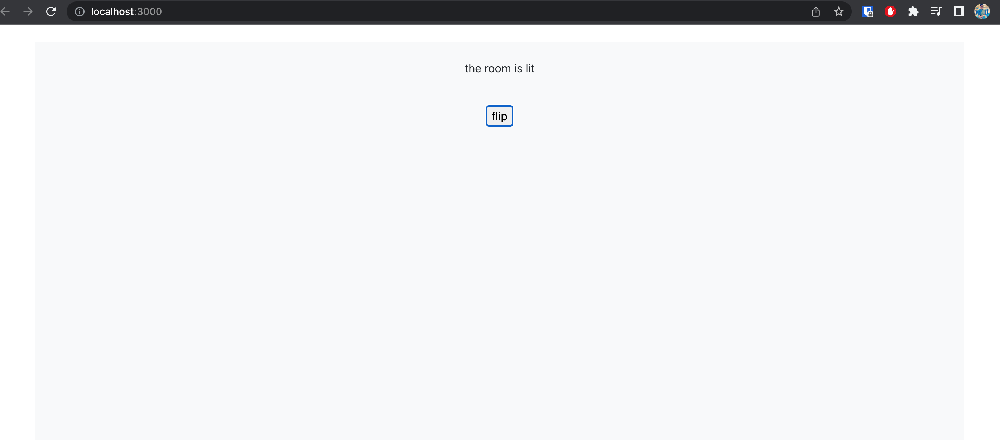
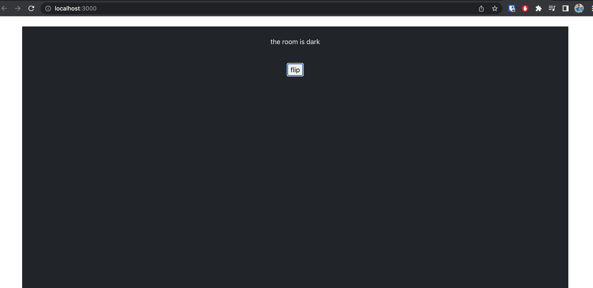

# React-Redux Room Light Switch

[Click here to see the App](https://fliplightswitch.netlify.app/)

This project was built with redux.

You can find more about the assignment at [Toggle Light Switch app](https://pestotech.teachable.com/courses/1911069/lectures/43351538) 

### Features
* User can toggle between light and dark background using the Flip switch

### Built using
* react
* rect-redux
* react toolkit
* bootstrap

### Screenshots
***


***

### Setup
1. clone repo
```
$ git clone https://github.com/tsungtingdu/react-url-shortener
```
2. go to project folder
```
$ cd lightswitch
```
3. install packages
```
$ npm install
```
4. run app
```
$ npm start
```

and you will see react app on http://localhost:3000

***
