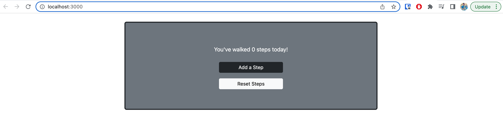

# React-Redux Steps Counter

[Click here to see App](https://stepcounterapp.netlify.app/)

This project was built with redux.

You can find more about the assignment at [Steps counter app](https://pestotech.teachable.com/courses/1911069/lectures/43351538) 

### Features
* User can increase the number of steps 1 at a time
* User can reset the number of steps to 0

### Built using
* react
* rect-redux
* react toolkit
* bootstrap

### Screenshots
***


***

### Setup
1. clone repo
```
$ git clone https://github.com/PotzarellaMozarella/p7-mohammad-Parisha/tree/week11/Week-11/stepcounter
```
2. go to project folder
```
$ cd stepcounter
```
3. install packages
```
$ npm install
```
4. run app
```
$ npm start
```

and you will see react app on http://localhost:3000

***
