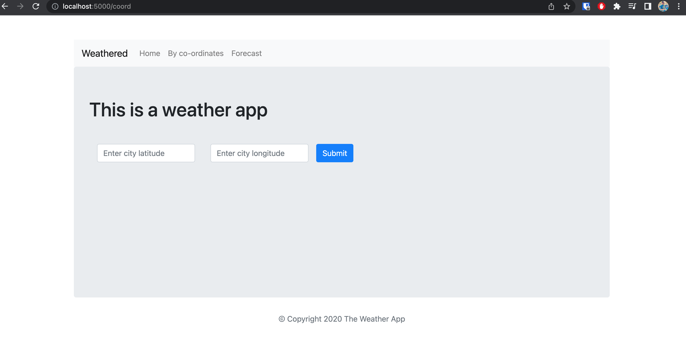
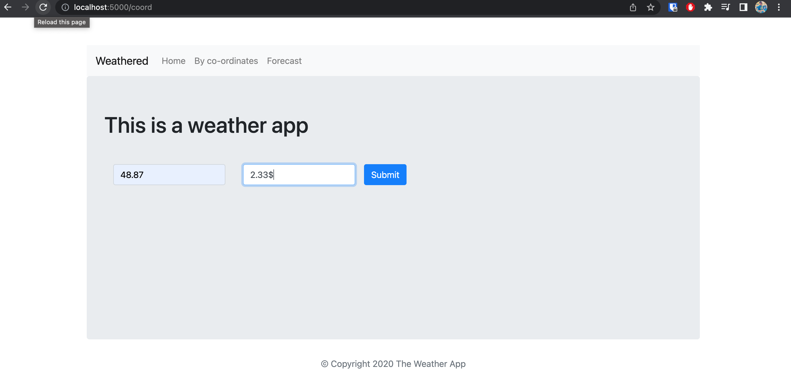
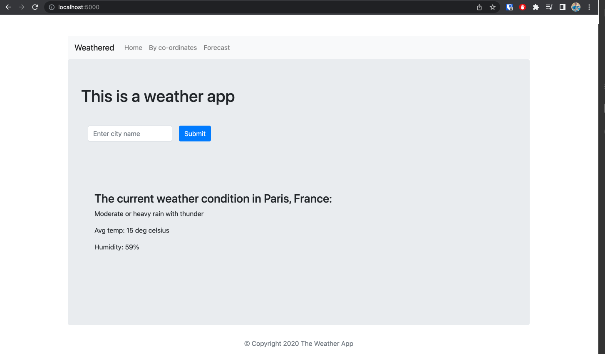
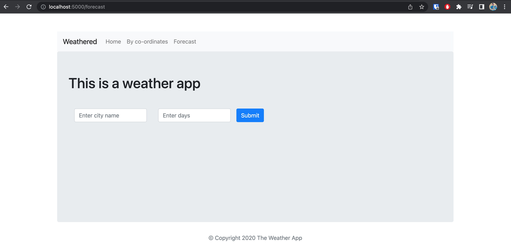

#  Weather App 

Using:
* Nodejs 
* Express 
* Open Weather


## Installation
1. Clone or download the repository.
2. Install all the dependencies using the following command.
   ```bash
   npm install
   ```
3. Run the application using the following command.
   ```bash
   npm run start
   ```
4. Test the application using the following command.
   ```bash
   npm run test
   ```
   
   Following instructions from
* OpenWeatherMap.org account https://openweathermap.org/api and generate an API key
* Setting up our URL with API key & include at top of server.js:
```javascript
const request = require('request');
const apiKey = '*****************';
```
* Open local host to render: http://localhost:XXXX/

### User Interface: How to use the app

##### Weather by city name
- Type the city you are looking for

- Click search button

- The app show information about the location and conditions of the city


##### Weather by city co-ordinates

- Type the city co-ordinate: latitude & longitude you are looking for
 
- Click search button

- The app show information about the location and conditions of the city


##### Also available code for (availability basis API permissions):
- Weather forecast for any city for the next X days

- Weather forecast for all cities paginated and filterable
- Weather forecast for any city historic/or in the future date