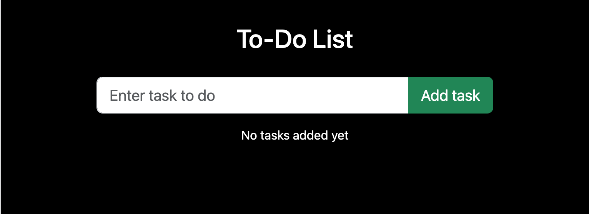

# To Do list App

This project was built with [Create React App](https://github.com/facebook/create-react-app)

You can find more about the assignment at [To do list app app](https://pestotech.teachable.com/courses/1911069/lectures/43351562) 

### Features
* User can add a new task in the to do list
* User can edit & update the existing tasks, mark them done, delete them
* User can mark the tasks done
* User can delete the tasks

### Built using
* react
* bootstrap
* font awesome


***
### Screenshots
##Home Page



##Add task


##Edit task


##Done task


***

### Setup
Clone or download repo NodeJS / NPM / Yarn should be installed in your PC
Open terminal or Git for Windows (Git Bash) Run these commands:

1. clone repo
```
$ git clone https://github.com/tsungtingdu/react-url-shortener
```
2. go to project folder
```
$ cd react-url-shortener
```
3. install packages
```
$ npm install
```
4. run app
```
$ npm start
```

and you will see react app on http://localhost:3000 in your browser.

The page will reload when you make changes.\
You may also see any lint errors in the console.

***
